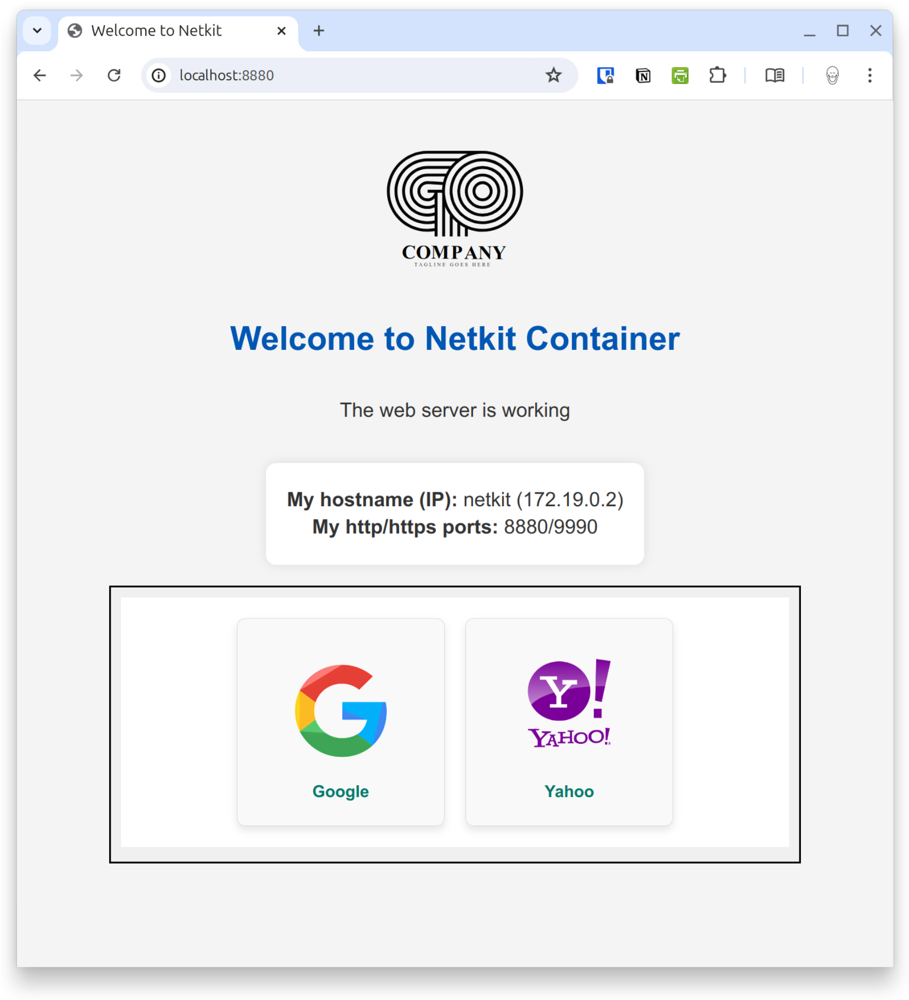

# NetKit Container


This Docker container is designed to provide a minimal Linux environment with multiple networking tools and an Nginx web server.

Typical use cases:

- Include it as a service in a existing docker-compose.yml project
- Use it as bastion to be "inside" your Docker network.
- Troubleshoot networking from within the docker network.

## Features

- **Nginx Web Server** with support for HTTP and HTTPS (ports configurable via environment variables `HTTP_PORT` and `HTTPS_PORT`).
- Automatically generated self-signed SSL certificates.
- Multiple included networking tools:

  - **Networking utilities:** curl, wget, dig, nslookup, ip, ifconfig, route, traceroute, tracepath, mtr, tcptraceroute, ping, arp, arping, ps, netstat, gzip, cpio, tar, telnet, tcpdump, jq, bash, iperf3, ethtool, mii-tool, nmap, ss, tshark, ssh, lftp, rsync, scp, netcat, socat, ApacheBench (ab), mysql & postgresql client, git.
  - **Text utilities:** gawk, cut, diff, find, grep, sed, vi editor, wc.

## Usage

### Consume the image in docker-compose.yml

This is the standar use case; I'm launching this container together with other services in my docker compose project. I use `netkit` as a bastion to troubleshoot and test other containers "from inside" the docker network. Here is an example of a docker-compose.yml file

```yaml
networks:
  my_network:
    name: my_network
    driver: bridge

services:
  redis:
    image: redis/redis-stack-server:latest
    hostname: redis.company.com
    container_name: redis
    restart: always
    ports:
      - 6379:6379
    networks:
      - my_network

  netkit:
    image: ghcr.io/sw-luis-palacios/base-netkit:main
    hostname: netkit.company.com
    container_name: netkit
    ports:
      - "8880:8880"
      - "9990:9990"
    environment:
      - HTTP_PORT=8880
      - HTTPS_PORT=9990
      - COMPANY_TITLE="Company Inc."
    networks:
      - my_network
```

You can create optional files that will be consumed by the container. Simply create a subdirectory called `config` and add and optional `index.html` and an optional `logo.svg` files.

```zsh
.
├── config
│   ├── index.html
│   └── logo.svg
```

Start your services

```sh
docker compose up --build -d
```

Following with this example you now can connect to [http://localhost:8880](http://localhost:8880), [https://localhost:9990](http://localhost:9990), or open an interactive shell `docker exec -it netkit /bin/bash` to perform your networking troubleshooting tasks.



Alternatively you might want to run the container in a oneliner, like:

```sh
docker run -d -p 80:80 -p 443:443 --name netkit ghcr.io/sw-luis-palacios/base-netkit:main
```

Or change the default ports

```sh
docker run -d -p 8880:8880 -p 9990:9990 --name netkit -e HTTP_PORT=8880 -e HTTPS_PORT=9990 ghcr.io/sw-luis-palacios/base-netkit:main
```

## For developers

If you copy or fork this project here are some usefull tips. This information is for developers that want to create their own base image, instead of consuming the image itself.

### Building the Image

To build the Docker image, run the following command in the directory containing the Dockerfile:

```sh
docker build -t your-github-username/netkit .
or
docker compose up --build -d
```

### Troubleshoot

```sh
docker run --rm -it --entrypoint /bin/bash --name mi_netkit --hostname netkit ghcr.io/sw-luis-palacios/base-netkit:main
```
